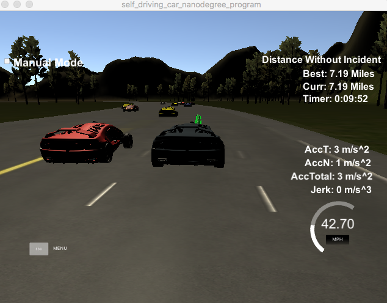

# CarND-Path-Planning-Project
Self-Driving Car Engineer Nanodegree Program
   
### Simulator.
You can download the Term3 Simulator which contains the Path Planning Project from the [releases tab] (https://github.com/udacity/self-driving-car-sim/releases).

### Goals

- Driving on a highway with Path Planning algorithm.
- Speed in range of 50±10 MPH.
- Acceleration < 10 m/s^2 
- Jerk < 50 m/s^
- No collision with any other cars.
- Avoiding drive out of the road.

# Rubrics

## Compilation

### The code compiles correctly.

Yes. Please do:

1. Clone this repo.
2. Make a build directory: `mkdir build && cd build`
3. Compile: `cmake .. && make`
4. Run it: `./path_planning`.

Here is the data provided from the Simulator to the C++ Program

## Valid Trajectories

To pass all the goals listed above, this program should succeed in making the car in simulator with these criterias:

- The car is able to drive at least 4.32 miles without incident.
- The car drives according to the speed limit.
- Max Acceleration and Jerk are not Exceeded.
- Car does not have collisions.
- The car stays in its lane, except for the time between changing lanes.
- The car is able to change lanes

I made all of them, and here is the screenshot of the result:


 
## Reflection

In brief, I used the code in QA section as the main part of the project. The Frenet-XY conversion based on the locations of maps were used to indicate the path. To planning the path, 5 points `[last_point, current_point, +30, +60, +90]` were used and a Polynomial Regression method in `spline.h` [http://kluge.in-chemnitz.de/opensource/spline/](http://kluge.in-chemnitz.de/opensource/spline/) were futher used to planning 50 future points for the car to drive.

However, the QA section did not provide the solution for lane-change. So I just re-wrote the [python-code ](https://d17h27t6h515a5.cloudfront.net/topher/2017/July/59793499_python-solution/python-solution.zip) given by the Behavior planning section and revised thses function for road.cpp so that this program could use the json sensor-fusion data:

```cpp
void Road::populate_traffic_using_sensor(const nlohmann::json &sensor_fusion){
  for (int i=0; i<sensor_fusion.size(); i++){
    int car_id = sensor_fusion[i][0];
    double vx = sensor_fusion[i][3];
    double vy = sensor_fusion[i][4];
    double check_speed = sqrt(vx*vx+vy*vy);
    double s_ = sensor_fusion[i][5];
    double d_ = sensor_fusion[i][6];
    int lane_ = d_ / 4;
    Vehicle vehicle(lane_, s_, check_speed, 0);
    vehicle.state = "CS";
    vehicles.insert(std::pair<int, Vehicle>(car_id, vehicle));
  }
}

void Road::update_traffic_using_sensor(const nlohmann::json &sensor_fusion){
  for (int i=0; i<sensor_fusion.size(); i++){
    int car_id = sensor_fusion[i][0];
    double vx = sensor_fusion[i][3];
    double vy = sensor_fusion[i][4];
    double check_speed = sqrt(vx*vx+vy*vy);
    double s_ = sensor_fusion[i][5];
    double d_ = sensor_fusion[i][6];
    int lane_ = d_ / 4;
    Vehicle v = vehicles.find(car_id)->second;
    //double prev_v = v.v;
    v.lane = lane_;
    v.s = s_;
    v.v = check_speed;
    //v.a = (check_speed-prev_v) / 0.05;
    vehicles.find(car_id)->second = v;
  }
}

void Road::add_ego(int lane_num, double s, init_config &config_data){
  Vehicle ego(lane_num, s, 0.0, 0.0);
  ego.configure(config_data);
  goal_lane = ego.goal_lane;
  goal_s = ego.goal_s;
  ego.state = "KL";
  vehicles.insert ( std::pair<int,Vehicle>(ego_key, ego) );
}

void Road::update_ego(int lane_num, double s_, double v_){
  Vehicle v = vehicles.find(ego_key)->second;
  double prev_v = v.v;
  v.lane = lane_num;
  v.s = s_;
  v.v = v_;
  v.a = (v_-prev_v);
  vehicles.find(ego_key)->second = v;
  //cout << "V and A is:" << v.v << "," << prev_v << "," << v.a << endl;
}

```

I used them in `main.cpp` as:

```cpp
if(not road.is_ego_init()){
	road.populate_traffic_using_sensor(sensor_fusion);
	road.add_ego(1, car_s, ego_config);
}
else{
   road.update_traffic_using_sensor(sensor_fusion);
   road.update_ego(lane, car_s, car_speed);
}
road.advance();
          
```


Now I could get a recommended state given by these scripts. So I just used `KL` `LCL` `LCR` states given by this function to predict what to do with the planned lane. However, the test code would change lane imediately when the command is sent, while for the simulator, it's not. What's more, the `road.cpp` planner seems not perform very well. So I just use that to tell the car to turn, but before the car really turns, it must check:

- Is any other car in the new lane > 30m ahead?
- Is any other car in the new lane > 20m behind?
- Is the car just turned a few seconds before? The behavior is sending command to the car with each every time it received a message, but for a turning command, it would take at least 150 message time to finish a successful turning.
- Is the car too fast or too slow? Too fast would hit the car ahead while too slow would hit the car behind.
- Is the car speeding up? Only a car with a>0 were permit to turn lanes because it is important to keep up speed in avoidance of being hit by cars behind.

I did this to make sure the car would do this:

```cpp
int prev_size = previous_path_x.size();
if(turn_lane_response_used >0){
  turn_lane_response_used += 1;
  if(turn_lane_response_used == turn_lane_response_time){
    turn_lane_response_used = 0;
  }
}
else if( (ego.state != "KL") and (car_speed < 40.0) and (car_speed > 25) and (ego.a > 0)){
  if(lane > 0 and ego.state == "LCL"){
    bool new_lane_too_close_ahead  = check_new_lane_dist(sensor_fusion, car_s, lane-1, prev_size, true);
    bool new_lane_too_close_behind = check_new_lane_dist(sensor_fusion, car_s, lane-1, prev_size, false);
    cout << lane << "," << ego.state << "," << turn_lane_response_used << new_lane_too_close_ahead << "," << new_lane_too_close_behind << endl;
    if ((not new_lane_too_close_ahead) and (not new_lane_too_close_behind)){
      lane -= 1;
      turn_lane_response_used += 1;
      action = "LCL";
    }

  }
  if(lane < road.lane_speeds.size()-1 and ego.state == "LCR"){
    bool new_lane_too_close_ahead = check_new_lane_dist(sensor_fusion, car_s, lane+1, prev_size, true);
    bool new_lane_too_close_behind = check_new_lane_dist(sensor_fusion, car_s, lane+1, prev_size, false);
    cout << lane << "," << ego.state << "," << turn_lane_response_used << new_lane_too_close_ahead << "," << new_lane_too_close_behind << endl;
    if ((not new_lane_too_close_ahead) and (not new_lane_too_close_behind)){
      lane += 1;
      turn_lane_response_used += 1;
      action = "LCR";
    }
  }
}      
```

# Futher works

- During my testing, a car in the right side of me suddenly ran into my lane and my car just hit it. If my car is a Tesla X, a _human take-over_ were required. The program need to improve to learn how to do in this condition.
- The car did not performed well for vehicle-following. A PID controller for speed would be a good tool to get a proper distance with the car ahead.
